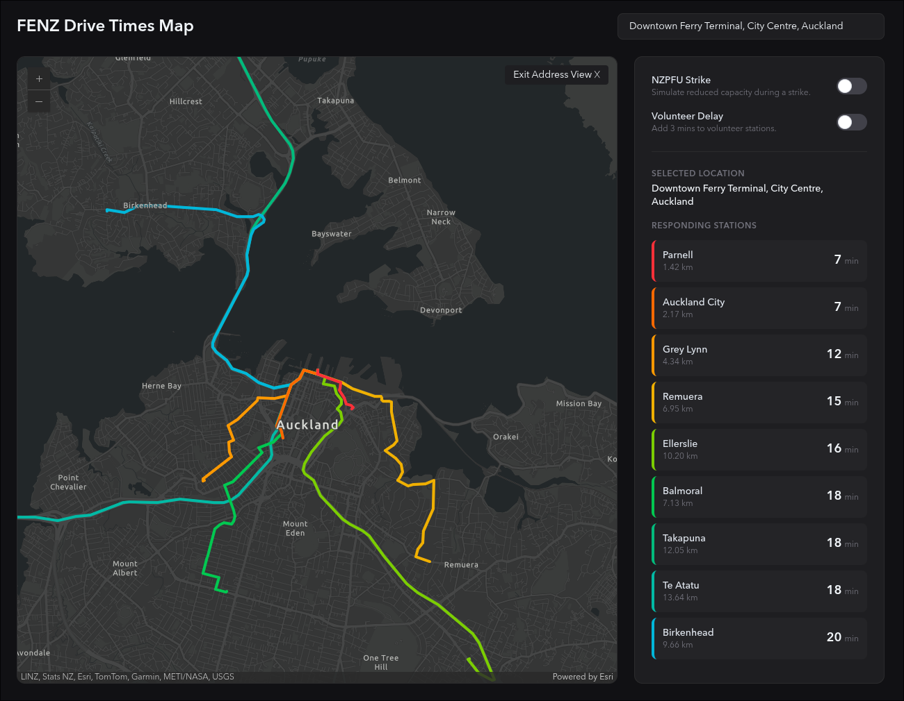
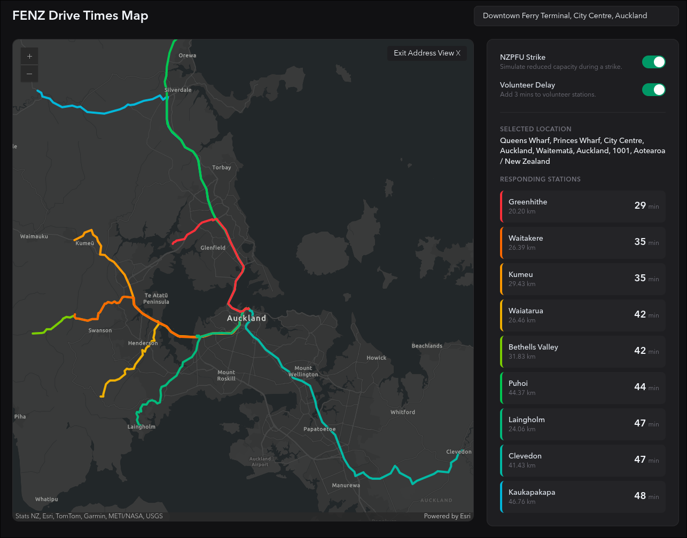

# FENZ Drivetimes

A GIS tool to simulate and visualize response times for Fire & Emergency New Zealand. Colour-codes the country based on minutes drive-time from a Fire Station, and allows you to lookup any address in NZ for specific drive-time information. Supports applying modifications such as [Paid Firefighter Strikes](https://direemergency.nz/), and average delays to Volunteer Appliances to the simulations.

## Why
This is interesting data that is otherwise hard to visualize. I also wanted a way to visually represent the coverage of Career Stations versus Volunteer stations, especially amidst the weekly Career Firefighter strikes. Being able to look up response times to a specific address is also cool:

  
  

## Dataset
This project uses publicly-available information collated for the purposes of this project. The data covers every fire station in New Zealand, including Career, Composite, Volunteer, Rural & Industry stations.

Please feel free to make a PR or Issue if you find an error in the data: [data/stations.ts](data/stations.ts).

## Running Locally
### Requirements
- An instance of [Open Route Service](https://openrouteservice.org/) with New Zealand data and a correctly configured driving profile; see the [ORS Docs](https://giscience.github.io/openrouteservice/run-instance/). You should **not** use the publicly available ORS instance. This project makes a significant number of requests, you *will* exceed their usage limits.
- An instance of [Nominatim](https://nominatim.org/) with New Zealand data. It is recommended you host your own instance.
- An instance of [Photon](https://photon.komoot.io/) with New Zealand data. It is recommended you host your own instance

### Environment Variables
Rename the `.env.example` file to `.env`. The project requires four enviroment variables to run:
- `OPEN_ROUTE_SERVICE_URL`: The URL of your ORS instance.
- `NOMINATIM_URL`: The URL of your Nominatim instance.
- `PHOTON_URL`: The URL of your Photon instance.
- `PORT`: The port the web server will start on.

### Starting FENZ-Drivetimes

- Ensure you have [Deno](https://deno.com/) installed.
- Use `deno install` if you haven't already to install the project's dependencies.
- Use `deno task start` to launch the project.
- If this is the first launch, you will have to wait for the data to generate. Otherwise, the application is available at the port in the `.env` file.

### First Load
On first load, the application will generate all isochrones for every station in New Zealand. This will take a long time. After this load, these files are stored in `cache/`, and start-up is instant.

#### This project is not associated with, made in collaboration with, or endorsed by Fire & Emergency New Zealand (FENZ). 